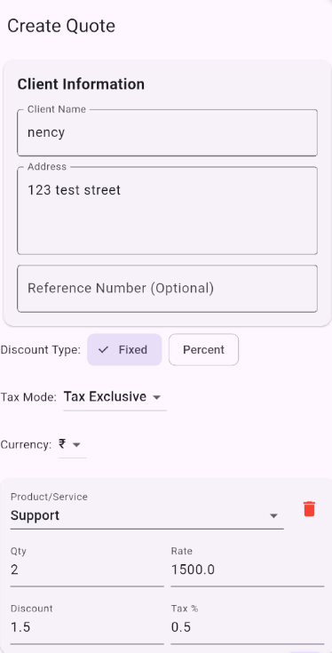
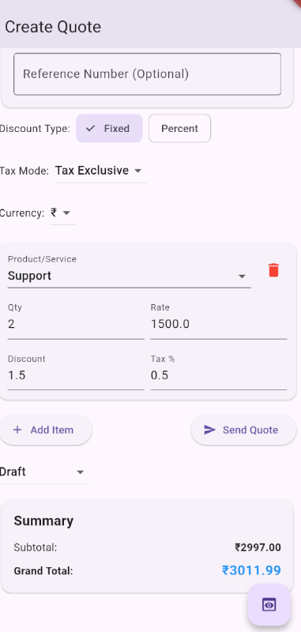
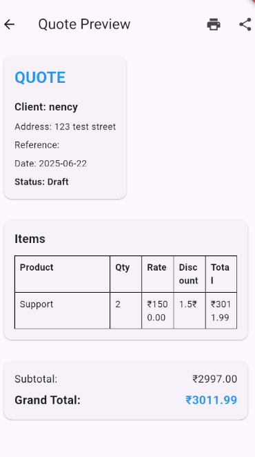

# Product Quote Builder

A Flutter application for creating and managing product quotes. This app allows users to quickly generate professional quotes for clients, including detailed line items, discounts, and taxes.

## Screenshots

| Create Quote | Add Line Item | Quote Preview |
| :---: | :---: | :---: |
|  |  |  |


## Features

- **Client Information:** Add and edit client details for each quote.
- **Line Items:** Add multiple products or services with details like quantity, rate, discount, and tax.
- **Flexible Discounts:** Apply discounts as a fixed amount or a percentage.
- **Tax Calculation:** Supports both tax-inclusive and tax-exclusive calculations.
- **Currency Selection:** Choose from multiple currencies (₹, $, €).
- **Quote Preview:** Generate a preview of the quote before sending.
- **PDF Generation:** Save and share quotes as PDF documents.
- **Data Persistence:** Saves quote data locally on the device.

## Getting Started

### Prerequisites

- [Flutter SDK](https://flutter.dev/docs/get-started/install)
- An editor like [VS Code](https://code.visualstudio.com/) or [Android Studio](https://developer.android.com/studio).

### Installation

1.  Clone the repository:
    ```sh
    git clone https://github.com/your-username/product_quote_builder.git
    ```
2.  Navigate to the project directory:
    ```sh
    cd product_quote_builder
    ```
3.  Install dependencies:
    ```sh
    flutter pub get
    ```
4.  Run the app:
    ```sh
    flutter run
    ```

## Usage

1.  Fill in the client's information at the top of the form.
2.  Select the desired discount type (Fixed or Percent) and tax mode (Tax Exclusive or Tax Inclusive).
3.  Choose the currency for the quote.
4.  Click the "Add Item" button to add a new product or service to the quote.
5.  Fill in the details for the line item and click "Add".
6.  Add as many line items as needed.
7.  Click the "Preview" button to see the generated quote. Share and Download as a PDF fuctionality will be added soon.

## Dependencies

- [provider](https://pub.dev/packages/provider): For state management.
- [intl](https://pub.dev/packages/intl): For internationalization and formatting.
- [printing](https://pub.dev/packages/printing): For generating and printing PDFs.
- [uuid](https://pub.dev/packages/uuid): For generating unique IDs.
- [shared_preferences](https://pub.dev/packages/shared_preferences): For local data storage.

---
*This README was generated with the help of an AI assistant.*
